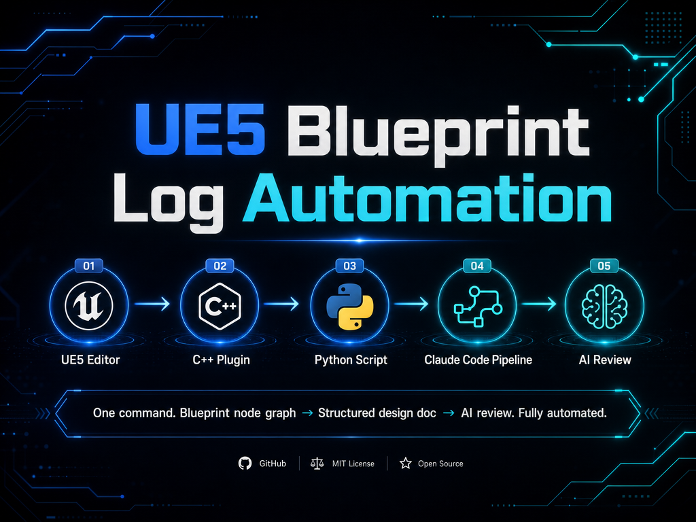

<p align="center">
  <picture>
    <source media="(prefers-color-scheme: dark)">
    
  </picture>
  <br/>
  
  
  
  
  
</p>

<p align="center">
  
</p>

---

## Why This Exists

You modify a Blueprint in UE5. Great. Now you need to document what changed — which nodes, which pins, which connections, which variables. For 26+ Blueprints. Across 5 maps. Every time.

**This toolchain automates the entire pipeline:**

```
You edit Blueprints in UE5
         │
  [C++ Plugin] ── penetrates UEdGraph → UEdGraphNode → UEdGraphPin → LinkedTo[]
         │
  [Python Script] ── exports complete topology for ALL Blueprints in the project
         │
  [Claude Code Skill] ── 5-phase pipeline: archive → diff → inject → verify → review
         │
  [AI Review] ── Qwen-Max + Gemini 3.5 Flash: architecture, accuracy, coverage
         │
  ✅ Versioned, structured, AI-reviewed design document. Zero manual effort.
```

**No more "I'll document it later."**

---

## ✨ What You Get

<table>
<tr><td width="140"><b>🔬 Deep Node Penetration</b></td><td>13 <code>K2Node_*</code> type casts. From <code>UEdGraph</code> → <code>UEdGraphNode</code> → <code>UEdGraphPin</code> → <code>LinkedTo[]</code>. Complete wiring topology.</td></tr>
<tr><td><b>🤖 Dual AI Review</b></td><td>Auto-trigger Qwen-Max after every update. Manual Gemini 3.5 Flash for adversarial verification. Architecture × Accuracy × Coverage.</td></tr>
<tr><td><b>📦 Versioned Archive</b></td><td>Every update: old version → <code>DemoMaterial_VersionUpdating/</code>, new version → <code>DemoMaterial_vX.X.X.md</code>. Zero deletion policy.</td></tr>
<tr><td><b>🎨 Industrial-Grade Typesetting</b></td><td>Apple Badge capsules for all 17 UE5 class types. Knope-style card blocks. keepachangelog versioning. Apple HIG 1px dividers.</td></tr>
<tr><td><b>📓 Obsidian + RealClaudian</b></td><td>Seamless Obsidian integration. Your notes + Agent workflow = bidirectional knowledge engine.</td></tr>
<tr><td><b>🛡️ Production Hardened</b></td><td>Vocabulary taboo (no "JSON/topology/script" traces in design docs). Data integrity rules. Comprehensive .gitignore.</td></tr>
</table>

---

## 🚀 Quick Start

### Prerequisites

| Component | Version |
|-----------|---------|
| Unreal Engine | 5.7 |
| Python | 3.11+ (UE5 embedded) |
| Claude Code | Latest |
| Obsidian *(optional)* | 1.x+ |

### 1. Install the C++ Plugin

Copy `UE_CPP_Plugin/` into your UE5 project's `Source/` directory:

```
YourProject/
└── Source/
    └── YourModule/
        ├── YourModule.Build.cs        ← add Json, JsonUtilities, BlueprintGraph dependencies
        ├── Public/
        │   └── BlueprintTopologyExporter.h
        └── Private/
            └── BlueprintTopologyExporter.cpp
```

**Required Build.cs dependencies:**

```csharp
PrivateDependencyModuleNames.AddRange(new string[] {
    "UnrealEd", "BlueprintGraph", "KismetCompiler", "Kismet",
    "Json", "JsonUtilities"
});
```

Close UE5 Editor, then compile:

```bash
UE_5.7/Engine/Build/BatchFiles/Build.bat YourProjectEditor Win64 Development "YourProject.uproject"
```

### 2. Set API Keys

In Claude Code's `settings.json`:

```json
{
  "env": {
    "QWEN_API_KEY": "your-qwen-api-key",
    "GEMINI_API_KEY": "your-gemini-api-key"
  }
}
```

### 3. Install the Claude Code Skill

Copy `Claude_Skill/SKILL.md` to:

- **Per-project**: `YourProject/.claude/skills/ue-daily-logger/SKILL.md`
- **Global**: `~/.claude/skills/ue-daily-logger/SKILL.md`

### 4. Run

```
UE5 Editor → Window → Output Log → Switch to Python mode:

py "/Path/To/Your/Project/tools/export_bp_metadata.py"
```

Then tell Claude Code:

```
更新UE日志
```

**That's it.** The pipeline handles everything else.

---

## 🏗️ Architecture

```
┌─────────────────────────────────────────┐
│              UE5 Editor                   │
│                                           │
│  Blueprints → C++ Plugin → Python Script  │
│            → AssessStatus_Json/*.json     │
└────────────────┬──────────────────────────┘
                 │
                 ▼
┌──────────────────────────────────────────┐
│         Claude Code Pipeline              │
│                                           │
│  1. Parse topology (13 K2Node types)      │
│  2. Read developer notes (UENoteBook/)    │
│  3. Cross-reference → diff detection      │
│  4. Inject into card-based design doc     │
│  5. Validate table integrity              │
│  6. AI review (Qwen-Max auto)             │
└────────────────┬──────────────────────────┘
                 │
                 ▼
     DemoMaterial_vX.X.X.md (design doc)
     Review_Docs/NN_Qwen_Review_*.md (audit reports)
```

### C++ Node Penetration Chain

```
UBlueprint
  ├─ UbergraphPages[]         ← Event graphs (BeginPlay, Tick, custom events)
  └─ FunctionGraphs[]         ← Function graphs (BPI implementations, pure functions)
        │
        ▼
      UEdGraph                ← Single graph
        └─ Nodes[]            ← UEdGraphNode array
              ├─ K2Node_CallFunction   → function calls
              ├─ K2Node_Event          → engine events
              ├─ K2Node_CustomEvent    → custom events
              ├─ K2Node_VariableGet/Set → variable access
              ├─ K2Node_Timeline       → timeline nodes
              ├─ K2Node_DynamicCast    → cast operations
              ├─ K2Node_IfThenElse     → branch nodes
              └─ ... (13 types total)
              └─ Pins[]       ← UEdGraphPin array
                    ├─ PinId          → FGuid (globally unique)
                    ├─ PinName        → "exec" / "then" / "ReturnValue"
                    ├─ Direction      → EGPD_Input / EGPD_Output
                    └─ LinkedTo[]     → ★ connection targets
```

---

## 📊 Real-World Stats

From actual production deployment across 2 UE5 projects:

| Metric | Value |
|--------|-------|
| Total Blueprints | 105 (79 Demo01 + 26 Demo02) |
| Largest Blueprint | `BP_BallAdventurePlayerPawn` — 227 nodes, 175 connections |
| BPI Interfaces | 5 suites across both projects |
| Design Doc Iterations | 7 versions (v1.0.0 → v1.0.7) |
| C++ Exporter | ~400 lines C++ + ~700 lines Python |

---

## 🔒 Security

### Privacy Audit

All files in this repository have been sanitized:

- Absolute paths → `/Path/To/Your/UE_Project/`
- Usernames → `YourUsername`
- API Keys → `YOUR_API_KEY_HERE`

### ⚠️ Intellectual Property Warning

The exported `AssessStatus_Json/ue_blueprint_status_*.json` contains your **complete Blueprint logic**. Never commit it to public repositories. The provided `.gitignore` already excludes `AssessStatus_Json/`.

### API Key Safety

- All keys read from environment variables, **never hardcoded**
- Missing keys → immediate `sys.exit(1)`, no fallback
- Use `.env` files locally (`.gitignore` excludes `*.env`)

---

## 📂 Repository Structure

```
UE5-Blueprint-Log-Automation/
├── README.md
├── README_zh.md                       ← 中文版
├── LICENSE
├── .gitignore
├── requirements.txt
├── Claude_Skill/
│   └── SKILL.md                       ← 5-phase pipeline definition
├── Scripts/
│   ├── export_bp_metadata.py          ← UE5 Python exporter (~700 lines)
│   └── qwen_reviewer.py              ← Qwen-Max review script
├── UE_CPP_Plugin/
│   ├── BlueprintTopologyExporter.h    ← C++ header
│   └── BlueprintTopologyExporter.cpp  ← C++ implementation (~400 lines)
└── Docs/
    ├── UE日志工作流使用手册.md         ← Full manual (Chinese)
    └── Obsidian_Integration.md        ← Obsidian setup guide
```

---

## 🎨 Apple Badge Color System (v1.0.10)

All 17 UE5 class types have color-coded badges in design documents:

| Color | Hex | Types |
|-------|-----|-------|
| 🔵 Blue | `#3b82f6` | Actor / Pawn / PlayerController / GameModeBase / StaticMeshActor |
| 🟢 Green | `#10b981` | Interface |
| 🟣 Purple | `#8b5cf6` | UserWidget |
| 🩵 Cyan | `#06b6d4` | Input Action / Input Mapping Context |
| 🟠 Amber | `#f59e0b` | Enum |
| 🟠 Orange | `#f97316` | Material / MaterialInstance / MaterialFunction |
| 💜 Indigo | `#6366f1` | Behavior Tree / Blackboard / BT Task |
| 🩷 Pink | `#ec4899` | AnimMontage / AnimSequence / Blend Space / AnimBlueprint |
| 🩶 Slate | `#64748b` | Static Mesh |
| ⬜ Gray | `#6b7280` | Custom inherited classes |

---

## 🤝 Contributing

Bug reports and pull requests welcome. Before submitting:

1. Follow UE5 C++ coding standards
2. Python scripts pass PEP 8
3. Documentation updated with code changes

---

## 📜 License

MIT © SpiralQWQ

---

<p align="center">
  <sub>If this saved you 100 hours of manual documentation — ⭐ the repo.</sub>
</p>
