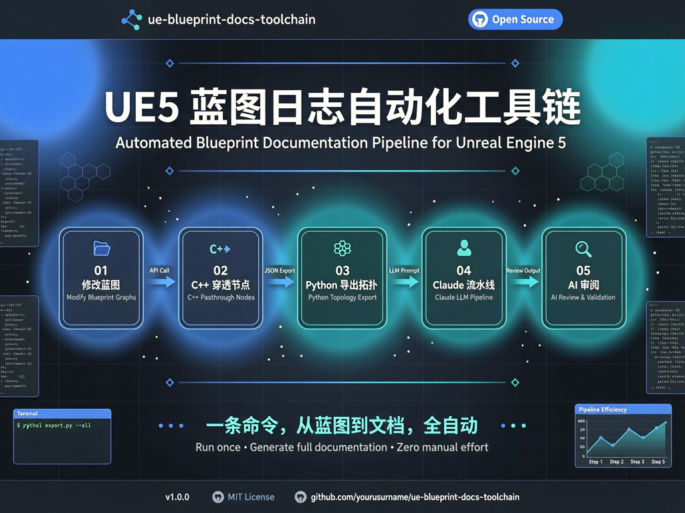

<p align="center">
  
  
  
  
  
</p>

<p align="center">
  
</p>

---

## 为什么做这个

你在 UE5 里改了一个蓝图。很好。现在你需要记录改了什么——哪些节点、哪些引脚、哪些连线、哪些变量。26 个蓝图。跨越 5 张地图。每次都要。

**这个工具链把整条流水线自动化了：**

```
你改蓝图
   │
  [C++ 插件] ── 穿透 UEdGraph → UEdGraphNode → UEdGraphPin → LinkedTo[]
   │
  [Python 脚本] ── 导出项目中所有蓝图的完整拓扑
   │
  [Claude Code Skill] ── 五阶段流水线：归档 → 比对 → 注入 → 验证 → 审阅
   │
  [AI 审阅] ── Qwen-Max + Gemini 3.5 Flash：架构合理性、技术准确性、覆盖率
   │
  ✅ 版本化、结构化、AI 审阅过的设计文档。零手动。
```

**再也不说「回头再写文档」了。**

---

## ✨ 核心特性

| 特性 | 说明 |
|------|------|
| 🔬 **深层节点穿透** | 13 种 `K2Node_*` 类型转换，从 `UEdGraph` → `UEdGraphNode` → `UEdGraphPin` → `LinkedTo[]`，完整还原连线拓扑 |
| 🤖 **双重 AI 审阅** | 每次更新自动调 Qwen-Max 审阅架构/准确性/覆盖率；支持 Gemini 3.5 Flash 手动对抗验证 |
| 📦 **版本化管理** | 每次更新自动归档旧版、生成新版，全程零删减 |
| 🎨 **工业级排版** | Apple Badge 胶囊覆盖 17 种 UE5 类型。Knope 卡片化区块。keepachangelog 版本号。Apple HIG 1px 分割线 |
| 📓 **Obsidian 联动** | 笔记 + Agent 工作流 = 双向知识引擎 |
| 🛡️ **生产级护栏** | 词汇禁忌（设计文档不暴露工具链痕迹）、数据完整性规则、完备的 `.gitignore` |

---

## 🚀 快速开始

### 环境要求

| 组件 | 版本 |
|------|------|
| Unreal Engine | 5.7 |
| Python | 3.11+（UE5 内嵌） |
| Claude Code | 最新版 |
| Obsidian（可选）| 1.x+ |

### 1. 安装 C++ 插件

将 `UE_CPP_Plugin/` 复制到 UE5 项目的 `Source/` 目录：

```
YourProject/
└── Source/
    └── YourModule/
        ├── YourModule.Build.cs        ← 添加 Json、JsonUtilities、BlueprintGraph 依赖
        ├── Public/
        │   └── BlueprintTopologyExporter.h
        └── Private/
            └── BlueprintTopologyExporter.cpp
```

**Build.cs 必需依赖：**

```csharp
PrivateDependencyModuleNames.AddRange(new string[] {
    "UnrealEd", "BlueprintGraph", "KismetCompiler", "Kismet",
    "Json", "JsonUtilities"
});
```

关闭 UE5 编辑器，编译：

```bash
UE_5.7/Engine/Build/BatchFiles/Build.bat YourProjectEditor Win64 Development "YourProject.uproject"
```

### 2. 配置 API Key

在 Claude Code 的 `settings.json` 中：

```json
{
  "env": {
    "QWEN_API_KEY": "你的千问密钥",
    "GEMINI_API_KEY": "你的Gemini密钥"
  }
}
```

### 3. 安装 Claude Code Skill

将 `Claude_Skill/SKILL.md` 复制到：

- **项目级**：`YourProject/.claude/skills/ue-daily-logger/SKILL.md`
- **全局**：`~/.claude/skills/ue-daily-logger/SKILL.md`

### 4. 运行

```
UE5 编辑器 → Window → Output Log → 切换为 Python 模式：

py "/你的项目路径/tools/export_bp_metadata.py"
```

然后对 Claude Code 说：

```
更新UE日志
```

**搞定。** 流水线自动处理剩下的一切。

---

## 🏗️ 架构

```
┌─────────────────────────────────────────┐
│              UE5 编辑器                   │
│                                           │
│  蓝图 → C++ 插件 → Python 脚本             │
│       → AssessStatus_Json/*.json          │
└────────────────┬──────────────────────────┘
                 │
                 ▼
┌──────────────────────────────────────────┐
│         Claude Code 流水线                 │
│                                           │
│  1. 解析拓扑（13 种 K2Node 类型）           │
│  2. 读取开发笔记（UENoteBook/）             │
│  3. 交叉比对 → 差异检测                    │
│  4. 注入卡片化设计文档                     │
│  5. 验证表格完整性                         │
│  6. AI 审阅（Qwen-Max 自动触发）            │
└────────────────┬──────────────────────────┘
                 │
                 ▼
     DemoMaterial_vX.X.X.md（设计文档）
     Review_Docs/NN_Qwen_Review_*.md（审阅报告）
```

### C++ 节点穿透链路

```
UBlueprint
  ├─ UbergraphPages[]         ← 事件图（BeginPlay、Tick、自定义事件）
  └─ FunctionGraphs[]         ← 函数图（BPI 实现、纯函数）
        │
        ▼
      UEdGraph                ← 单个图表
        └─ Nodes[]            ← UEdGraphNode 数组
              ├─ K2Node_CallFunction   → 函数调用
              ├─ K2Node_Event          → 引擎事件
              ├─ K2Node_CustomEvent    → 自定义事件
              ├─ K2Node_VariableGet/Set → 变量读写
              ├─ K2Node_Timeline       → 时间线
              ├─ K2Node_DynamicCast    → 类型转换
              ├─ K2Node_IfThenElse     → 分支
              └─ ...（共 13 种）
              └─ Pins[]       ← UEdGraphPin 数组
                    ├─ PinId          → FGuid（全局唯一）
                    ├─ PinName        → "exec" / "then" / "ReturnValue"
                    ├─ Direction      → EGPD_Input / EGPD_Output
                    └─ LinkedTo[]     → ★ 连线目标
```

---

## 📊 实际数据

来自 2 个 UE5 项目的生产部署：

| 指标 | 数值 |
|------|------|
| 蓝图总数 | 105（Demo01 79 + Demo02 26） |
| 最大蓝图 | `BP_BallAdventurePlayerPawn` — 227 节点 / 175 连线 |
| BPI 接口 | 5 套 |
| 设计文档迭代 | 7 个版本（v1.0.0 → v1.0.7） |
| C++ 导出器 | ~400 行 C++ + ~700 行 Python |

---

## 🔒 安全

### 隐私脱敏

本仓库所有文件已完成脱敏：

- 绝对路径 → `/Path/To/Your/UE_Project/`
- 用户名 → `YourUsername`
- API Key → `YOUR_API_KEY_HERE`

### ⚠️ 知识产权保护

导出的 `AssessStatus_Json/ue_blueprint_status_*.json` 包含你的**完整蓝图逻辑**。严禁提交到公共仓库。`.gitignore` 已默认排除 `AssessStatus_Json/`。

### API Key 安全

- 全部通过环境变量读取，**从不硬编码**
- 缺失 Key → 立即 `sys.exit(1)` 终止，无回退值
- 本地使用 `.env` 文件（`.gitignore` 已排除 `*.env`）

---

## 📂 仓库结构

```
UE5-Blueprint-Log-Automation/
├── README.md                          ← 英文版（主 README）
├── README_zh.md                       ← 中文版
├── LICENSE
├── .gitignore
├── requirements.txt
├── Claude_Skill/
│   └── SKILL.md                       ← 五阶段流水线定义
├── Scripts/
│   ├── export_bp_metadata.py          ← UE5 Python 导出脚本
│   └── qwen_reviewer.py              ← Qwen-Max 审阅脚本
├── UE_CPP_Plugin/
│   ├── BlueprintTopologyExporter.h    ← C++ 头文件
│   └── BlueprintTopologyExporter.cpp  ← C++ 实现
└── Docs/
    ├── UE日志工作流使用手册.md         ← 完整使用手册
    └── Obsidian_Integration.md        ← Obsidian 协同指南
```

---

## 🎨 Apple Badge 色系（v1.0.10）

设计文档中 17 种 UE5 类型的彩色胶囊：

| 颜色 | 色值 | 类型 |
|------|------|------|
| 🔵 蓝 | `#3b82f6` | Actor / Pawn / PlayerController / GameModeBase / StaticMeshActor |
| 🟢 绿 | `#10b981` | Interface |
| 🟣 紫 | `#8b5cf6` | UserWidget |
| 🩵 青 | `#06b6d4` | Input Action / Input Mapping Context |
| 🟠 琥珀 | `#f59e0b` | Enum |
| 🟠 橙 | `#f97316` | Material / MaterialInstance / MaterialFunction |
| 💜 靛 | `#6366f1` | Behavior Tree / Blackboard / BT Task |
| 🩷 粉 | `#ec4899` | AnimMontage / AnimSequence / Blend Space / AnimBlueprint |
| 🩶 石板 | `#64748b` | Static Mesh |
| ⬜ 灰 | `#6b7280` | 自定义继承类 |

---

## 🤝 贡献

欢迎提交 Bug 报告和 Pull Request。提交前：

1. 符合 UE5 C++ 编码标准
2. Python 脚本通过 PEP 8 检查
3. 文档与代码变更同步

---

## 📜 许可

MIT © SpiralQWQ

---

<p align="center">
  <sub>如果这个工具帮你省了 100 小时手动写文档——给个 ⭐ 吧。</sub>
</p>
